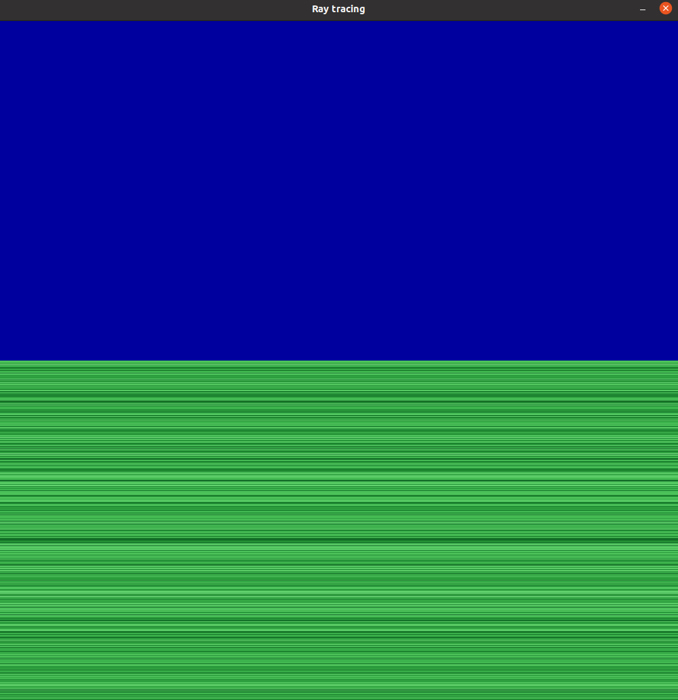

# 3D_renderer_hse

HSE AMI CS course program project 2022

# Make
To build it just run ``make``
You can run ``make clean to delete make auxiliary files``

# Run
To start the program just run ``./sfml-app``

``WASD`` - movement relative to the camera position
``Space/C`` - vertical camera movement
``Arrows`` - camera control
``Period/Comma`` - changing the position of the observer relative to the screen 
``Quote/Semicolon/LBracket/RBracket`` - screen distorshion
``Enter`` - reset all,
``Esc`` - show coursor to close the window

# Screenshots

